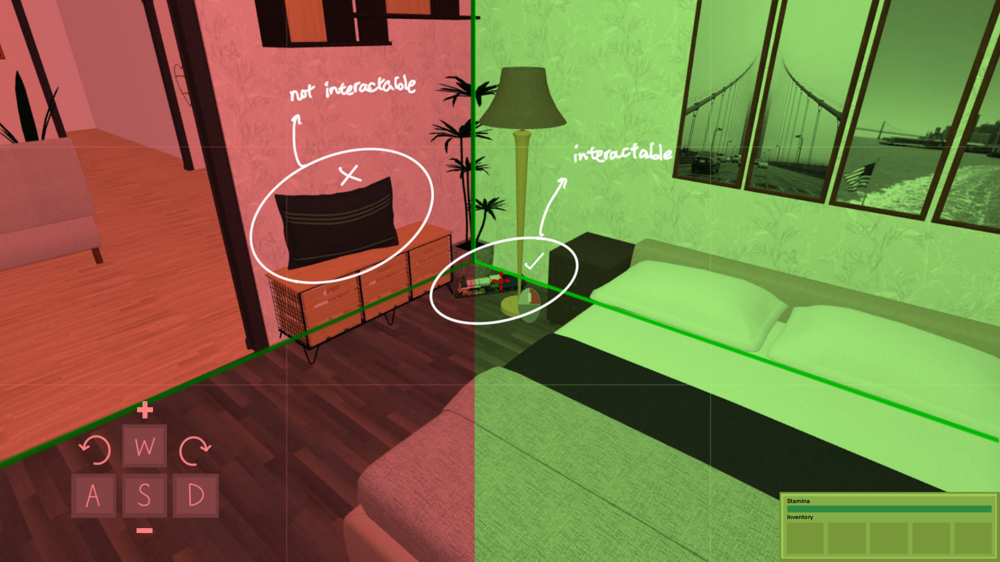

# Game Design Document

## Game Overview

### Artistic Intention
The artistic intention of this game is to illustrate the uncertainty of the safety of a woman's life.

The game aims to create an uneasiness that results from external factors beyond the woman's controls, toying with the idea of "to what extent can you anticipate and control for things" in a game genre that is expected to be otherwise calm, simple, and cozy.

It aims to demonstrate the perpetual state of uncertainty that a woman has to face when ensuring her own safety, especially alone at night, evoking a sense of empathy via immersing the player in the experiences of the main character.

### Core Concept

The game is an RPG puzzle game, called *Closing Shift*, where the player is playing the character of a female furniture store employee on her closing shift.

The tasks are simple, the player needs to figure out where things are out of place and where they should move them back to. The player is limited by their stamina as to what they can move and how quickly they can move it, and within the furniture store there's a perpetrator. 

The perpetrator is never seen, but their presence is sensed. The player cannot leave the furniture store and get to safety without first returning everything to the right place.

Since the player eventually becomes aware of the perpetrator, they have to constantly check around for their safety. The perpetrator aims to get to the player. They do this by keeping them in the store for longer by messing with the organisation, until the player loses enough focus.

These challenges are what make the game unique; it takes a popular game genre and flips it over its head, whilst addressing real world issues.

The tasks and puzzles would be similar to games such as *A Little to the Left* or *Unpacking*, with an element of suspense like *Among Us* or *Five Nights at Freddy's*.

The game is aimed at players that enjoy cozy puzzle/organisation games and are looking for something a bit more intense and challenging, or already enjoy suspenseful puzzle games.

## Story and Narrative

The game takes place in a modular furniture showroom store, akin to Ikea, where the player controls the protagonist, a female employee assigned to the closing shift.

As the protagonist continues with their shift to close the store, they realise that there is a perpetrator in the building. However, the protagonist's phone is dead, they can't call for help, and they're on the last straw for their job; if they don't finish closing up well tonight, they'll be fired.

The protagonist isn't sure who the perpetrator is, but they figure out they're not here to rob the store, but rather they're here for her, but she knows she can protect herself, as long as she keeps an eye out.

Regardless, the protagonist continues on with her closing shift, but she slowly begins to lose vision and motor functions. She realises she's been drugged and now needs to leave the store. However, she will always fail to make it out before she completely loses consciousness, and is captured by the perpetrator.

## Gameplay and Mechanics

### Game Controls

The game will be played in first person from the protagonist's point of view.

The player can use their mouse to look around and interact with objects depending on where their center crosshair is located, however the player’s ability to look around is restricted by the general direction their body is facing. In essence, this means that the camera’s position is fixed at where the player is currently standing, but its angle and direction can be manipulated by the player within certain constraints; the player can only ever interact with objects on the same wall plane that they are facing, unless they explicitly turn.

For example, the crosshair is restricted to the green region below, as the player has not yet turned.

 

The same rule exists for the other side, the crosshair cannot go beyond the vertical green line.

To explicitly turn around and change the direction the player is facing so that they can now interact with objects across beyond the vertical green line, they can do full 90 degree turns, using either the `a` key for a left turn, or the `d` key for a right turn.

For example, after turning left with the `a` key, we can see more of the room, other rooms, and interact with new objects.

 | 
--- | ---

This also means for the player to turn around to face the opposite direction, it requires multiple actions. But with either two left or right turns, the player can face what was before behind them.

To interact with objects, the player can right click to potentially learn more about the object, or left click to pick up the item.

Since the player cannot move freely within the room as one might expect, they can instead zoom in and out towards objects using the `w` and `s` keys respectively.

 | 
--- | ---

To move through rooms, the player is required to interact with door frames. The player can left click to move to room and turn off the lights behind them, or right click to move without turning off the lights.

Lights automatically turn on in a room when a player walks into it. 

### Inventory
The player can hold up to 5 objects that they can pick up by left clicking, they can then use the scroll wheel or number keys to cycle between items, and left click again to place them into the world where they're pointing.

### Stamina
As an additional challenge to the player, the character will have a stamina bar. This bar will be affected by what the player is carrying and for how long.

The lower the player's the stamina, the slower their movement and in game animations; each turning action and interaction has its own animation time. If the player's stamina ever gets too low/runs out, they drop everything they're holding and have to wait for it to regenerate.

The regeneration rate for stamina decreases as time goes on to simulate real life exhaustion, and to make it more difficult towards the endgame.

There will also be other impairments that happen to the player, such as reduced vision, resulting from low stamina or "attacks" from the perpetrator, making the game more challenging towards the endgame as well.

### The Perpetrator and Lights

The perpetrator is the source of the eerieness of the game and one of the biggest challenges.

Once they are introduced, after some tasks have been completed, the player will learn that the way to stay safe is to never leave their back unchecked for too long. So they will need to constantly turn around to check they are safe. 

If the player is surrounded by unlit rooms, they are in a greater danger of being attacked by the perpetrator and losing the game, so they must turn around and check their safety more frequently. 

However, unlit rooms have the advantage that the perpetrator is unable to mess with any of the player's organisations. If the player leaves a lit room, or multiple, there is a random chance that something in there moves to the wrong place as a result of the perpetrator, which the perpetrator cannot do in a dark room.

If the perpetrator does move objects, the player will have to fix them before they can complete the game and "win".

### Completing the Game

The player can only win by shutting off the lights in every room after returning everything to the right place, then making their way to the elevator to leave the furniture store.

It is up to the player to ensure everything in the right place, some objects will be obvious, whilst others can be a bit more discreet, this is the inherent puzzle aspect of the game.

## Levels and World Design 

### Game World

The game world is set in a furniture store akin to IKEA, and the player currently works as an employee who is on closing shift for the night. The furniture store is laid out like a grid with multiple rooms which act as installations for different home regions (i.e. living room, bedroom, kitchen, etc).

The player navigates through this 3D grid world as described in the [Game Controls Section](#game-controls) through mouse movement which turns the camera angle within certain limits, and through changing their directional perspective which changes the general direction they are facing. Traversing through rooms can be done by interacting with the doorway that joins 2 adjacent rooms. 

A map of the world is provided but is only available stapled onto certain walls of certain rooms. This means that the player does not have constant access to the map and would either have to constantly refer to the rooms with maps, or to memorize the map.

### Objects
The main interactables of the game world are the different fixtures and objects in the furniture installations. The main movement interactable would be the archways that transition the player from one room to another. 

As for items that are to be rearranged, these objects include books, toys, pillows, chairs, etc. These interactable objects do not meaningfully interact with each other, but can potentially be placed adjacent or on top of each other. The player’s main interactions with these objects include the ability to gain some information about them through the character’s internal monologue (right-click) or to take the object into the character’s inventory (left-click).

Taking objects requires a certain amount of stamina depending on the object’s size and weight. The player can then put down objects from their inventory by selecting the object in their inventory HUD (via scroll wheel or number keys) and left-clicking on the desired location.

### Physics
This game incorporates minimal game physics as it is inspired from the genre of static puzzle games but implemented in a 3D space. Player interactions with objects are mostly indicated by the appearance and disappearance of objects in the space and in the player’s inventory, or via brief cutscenes in the case of door interactions.

## Art and Audio

### Art Style

The game’s art style and aesthetic is very inspired by *The Stanley Parable* and the *Five Nights at Freddy's* franchise. The game world is not expected to be completely realistically rendered but also not completely cartoon-like either. The furniture is expected to be cell shaded, mostly low-polygonal and flat in texture. 

 |  
--- | ---
*The Stanley Parable* | *Five Nights at Freddy's: Security Breach*

As for the ambience, the game is meant to convey a sense of eeriness through emptiness and lack of human interaction. The game is meant to start off rather bright, like a warehouse with all the lights on. At this stage, the game conveys eeriness mainly through how artificial and sterile the game world is (as a result of the rooms being artificial installations of home living spaces). However, as more lights shut off, the game is meant to convey eeriness through its darkness, and an overall loss of sensory and spatial awareness through lack of sight. 

The game also toys with how liminal spaces (in this case the furniture installations) can make players’ feel uneasy or out of place.

Concept art and sketches of the main character: 

### Sound and Music

When the game begins, the music is expected to be quite cozy and light. This is meant to convey the main character’s overall confidence in her safety and before she realizes she is in danger. However, the minute she starts hearing the footsteps of the stalker, the music cuts out and the music of the gain shifts to barely noticeable eerie and off-putting background music. 

As for sounds, the aim is to make sounds as minimal but purposeful as possible. For example, footsteps are going to be key in demonstrating the presence of the stalker but also the movement of the player as she walks through the game world. Furthermore, there will be swishing sounds whenever the player interacts with any objects, and some objects will produce their own noises (i.e. clocks will tick and some TVs left on will be playing jingles/commercials for the store).

### Assets
The artistic visual assets used in this game are most likely going to be purchased from the official unity store for assets. As for sound, most sounds are expected to be sourced from royalty free sfx websites.

Some candidate asset packages are:

1. Low Poly House Interior & Exterior --- https://assetstore.unity.com/packages/3d/props/low-poly-house-interior-exterior-216310#content
2. Low Poly Office Interiors --- https://assetstore.unity.com/packages/3d/props/interior/low-poly-office-interiors-232021
3. Zapslat.com (Audio) --- https://www.zapsplat.com/ 

## User Interface (UI)

### In Game UI
The User Interface of the game is expected to be very simplistic, complementing the simplistic style of the assets in the game. 

Main features of the UI include:
1. Inventory HUD that shows the different objects currently possessed by the player
2. Stamina bar for the player
3. Central crosshair that allows player to interact with certain objects
4. WASD button images that show controls for switching directional perspectives and zooming in/out
5. Pop-up mouse icons that indicate interact options
6. Pop-up internal monologue that gives context and information about items
7. Pop-up taskbar that tracks currently ongoing tasks

### Main Menu UI

This is the planned structure for the main menu.

## Technology and Tools

As per the requirements of the project, Unity and GitHub will be used for game development and version control respectively.

Additionally, the team will be using Procreate for sketches, as well as Blender 3D Modelling, as those are the tools we are familiar with.

## Team Communication, Timelines, and Task Assignment

Work on the project will be contributed to equally. Team members have various strengths, so we have allocated leadership in those areas to those individuals.

* Taher: Developement and Technical Implementations
* Lynn: Art and Design
* Tarish: Storyboard and Narrative

We have set up a discord server which will be our primary method of communication, with channels and threads to be created for different areas and specific implementations.

A Trello board will also be used to track progress of tasks.

Outside chat communication, Team members will meet twice weekly to share progress and updates on development.

## Possible Challenges

The biggest challenge in the development of the game is likely going to be setting a good pace. Since the controls are intentionally slightly unintuitive, there needs to be a balance to make the game enjoyable to play and navigate, whilst also keeping it challenging. 

Designing good puzzles that aren't too difficult or too easy to suit the pacing will require quite a bit of play testing. The game should be challenging, such that the player is interested, but not too challenging that it is unnecessarily tedious or frustrating. 

Implementing the randomness also might be challenging; the changes the perpetrator makes need to be noticeable but not too obvious. This also ties into initial world generation, so that if the player loses and the game resets, thing should be sufficiently different so the player cannot just memorise a list of things to move and where, which is limited by the scope of a furniture store and the size of the world.
